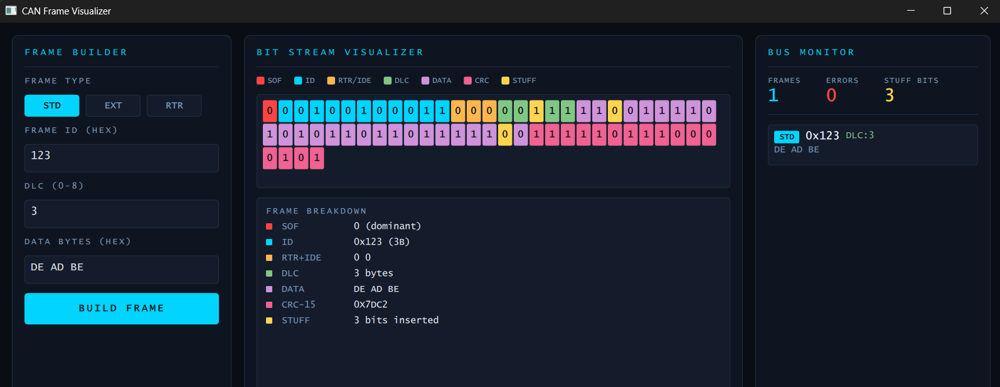

# CAN Frame Visualizer

A desktop application built with Qt Quick (QML) and C++ that visualizes CAN bus frames in real time — color-coded bit stream, protocol breakdown, and bus monitor.

The C++ backend is powered by the [can-bus-implementation](https://github.com/nassib-es/can-bus-implementation) library — frame encoding, CRC-15 and bit stuffing implemented from scratch.

---

## Demo



---

## Features

- **3 frame types** — Standard (11-bit ID), Extended (29-bit ID), Remote (RTR)
- **Color-coded bit stream** — each protocol field highlighted in a distinct color
- **Bit stuffing visualization** — inserted stuff bits shown in yellow
- **CRC-15 display** — actual checksum value calculated and shown in the breakdown
- **Bus monitor** — live log of all frames sent with frame count, error count and stuff bit counter
- **Clean dark UI** — built with Qt Quick, monospace industrial aesthetic

---

## Architecture

```
QML Frontend (Main.qml)
    └── CANBackend (C++ QObject, exposed via QML context)
            └── CANFrame    — frame encoding
            └── CRC15       — checksum calculation  
            └── BitStuffing — bit insertion/removal
```

The backend is registered as a context property in `main.cpp` — QML calls `canBackend.buildFrame()` and receives a structured result with the full bit stream and breakdown data.

---

## Project Structure

```
can-frame-visualizer/
├── src/
│   ├── CANBackend.cpp     # Qt/QML bridge — builds frames, encodes bit stream
│   ├── CANFrame.cpp       # CAN frame encoding (STD, EXT, RTR)
│   ├── CRC15.cpp          # CRC-15 calculation (polynomial 0x4599)
│   └── BitStuffing.cpp    # Bit stuffing/destuffing
├── include/
│   ├── CANBackend.hpp
│   ├── CANFrame.hpp
│   ├── CRC15.hpp
│   └── BitStuffing.hpp
├── Main.qml               # Qt Quick UI
├── main.cpp               # App entry point, backend registration
└── CMakeLists.txt
```

---

## Build

### Requirements
- Qt 6.x with Qt Quick
- CMake
- MinGW or MSVC compiler

### Compile & Run
Open `CMakeLists.txt` in Qt Creator → Build → Run

---

## Color Legend

| Color | Field |
|-------|-------|
| 🔴 Red | SOF — Start of Frame |
| 🔵 Cyan | ID — Frame identifier |
| 🟠 Orange | RTR / IDE / SRR control bits |
| 🟢 Green | DLC — Data Length Code |
| 🟣 Purple | Data bytes |
| 🩷 Pink | CRC-15 checksum |
| 🟡 Yellow | Stuff bits (inserted) |

---

## Related

- [can-bus-implementation](https://github.com/nassib-es/can-bus-implementation) — the C++ protocol library with unit tests that powers this visualizer

---

## Author
Nassib El Saghir — [LinkedIn](https://linkedin.com/in/nassib-el-saghir) — [GitHub](https://github.com/nassib-es)